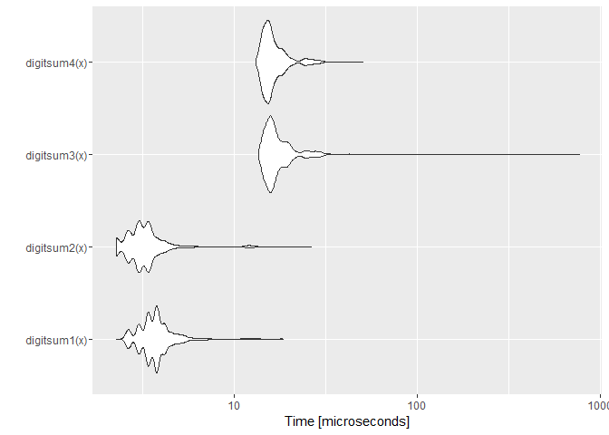
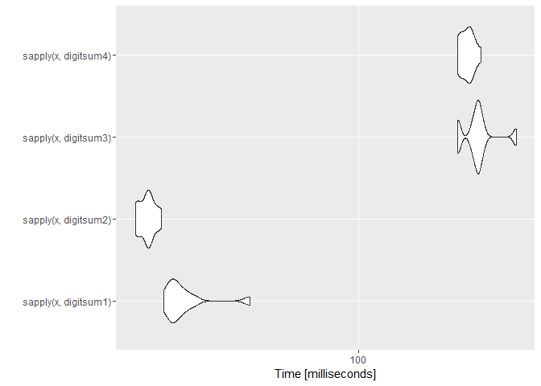

Benchmarking Functions to Compute the Sum of Digits
===================================================

#### *Uwe Block*

#### 2016-03-28

Introduction
------------

This is inspired by [Rätsel der Woche](http://www.spiegel.de/wissenschaft/mensch/raetsel-der-woche-verflixtes-jahr-2016-a-1069870.html) (*Puzzle of the Week*) in [Spiegel Online](http://www.spiegel.de/wissenschaft/mensch/raetsel-der-woche-verflixtes-jahr-2016-a-1069870.html) titled [Verflixtes Jahr 2016](http://www.spiegel.de/wissenschaft/mensch/raetsel-der-woche-verflixtes-jahr-2016-a-1069870.html) (*Cursed Year 2016*) by [Holger Dambeck](http://www.spiegel.de/impressum/autor-1707.html). The puzzle requires to find all years where the sum of the year plus the sum of digits of the year plus the sum of digits of the sum of digits of the year yields 2016.

Here is *one* of the possible solutions (there are some more to find):

``` r
1992 + sum_of_digits(1992) + sum_of_digits(sum_of_digits(1992)) =
1992 + (1 + 9 + 9 + 2)     + sum_of_digits(sum_of_digits(1992)) =
1992 + 21                  + sum_of_digits(sum_of_digits(1992)) =
1992 + 21                  + sum_of_digits(21)                  =
1992 + 21                  + (2 + 1)                            =
1992 + 21                  + 3                                  =
2016
```

To find all solutions requires to test a vector of calendar years. However, I was quite surprised to learn that `R` lacks a built-in function for computing the sum of digits of an integer number. Searching the web I found two hints

-   <http://stackoverflow.com/questions/18675285/digit-sum-function-in-r>
-   <https://stat.ethz.ch/pipermail/r-help/2011-March/270786.html>

suggesting different ways to compute the sum of digits. Unfortunately, the different methods were not compared in terms of speed.

Function Definitions
--------------------

### Variant 1

Suggested by [user2030503](http://stackoverflow.com/users/2030503/user2030503) in his question on [stackoverflow](http://stackoverflow.com/q/18675285/3817004):

``` r
digitsum1 <- function(x) sum(as.numeric(unlist(strsplit(as.character(x), split = ""))))
```

Sample results:

``` r
digitsum1(1234L)
#> [1] 10
sapply(1992L:2012L,  digitsum1)
#>  [1] 21 22 23 24 25 26 27 28  2  3  4  5  6  7  8  9 10 11  3  4  5
```

### Variant 2

Suggested by [Julius](http://stackoverflow.com/users/1320535/julius) in his answer on [stackoverflow](http://stackoverflow.com/a/18675519/3817004):

``` r
digitsum2 <- function(x) sum(floor(x / 10^(0:(nchar(x) - 1))) %% 10)
```

Sample results:

``` r
digitsum2(1234L)
#> [1] 10
sapply(1992L:2012L,  digitsum2)
#>  [1] 21 22 23 24 25 26 27 28  2  3  4  5  6  7  8  9 10 11  3  4  5
```

### Variant 3

Using function `digitsBase` from package `GLDEX` as suggested by [42-](http://stackoverflow.com/users/1855677/42) in his answer on [stackoverflow](http://stackoverflow.com/a/18675445/3817004):

``` r
library(GLDEX, quietly = TRUE)
digitsum3 <-  function(x) sum(digitsBase(x, base = 10))
```

Sample results:

``` r
digitsum3(1234L)
#> [1] 10
sapply(1992L:2012L,  digitsum3)
#>  [1] 21 22 23 24 25 26 27 28  2  3  4  5  6  7  8  9 10 11  3  4  5
```

### Variant 4

Based on a function by Greg Snow in the [R-help mailing list](https://stat.ethz.ch/pipermail/r-help/2011-March/270786.html):

``` r
digitsum4 <- function(x) {
  sum(
    if(length(x) > 1 ) {
      lapply(x, digits)
    } else {
      n <- nchar(x)
      rev( x %/% 10^seq(0, length.out=n) %% 10 )
    }
  )
}
```

Sample results:

``` r
digitsum4(1234L)
#> [1] 10
sapply(1992L:2012L,  digitsum4)
#>  [1] 21 22 23 24 25 26 27 28  2  3  4  5  6  7  8  9 10 11  3  4  5
```

Benchmarks
----------

``` r
library(microbenchmark, quietly = TRUE)
library(ggplot2, quietly = TRUE)

# define check function
my_check <- function(values) {
  all(sapply(values[-1], function(x) identical(values[[1]], x)))
}

x <- 1234L
bm1 <- microbenchmark(
  digitsum1(x),
  digitsum2(x),
  digitsum3(x),
  digitsum4(x),
  times = 1000L, check = my_check
)
print(bm1)
#> Unit: microseconds
#>          expr    min     lq      mean median     uq     max neval
#>  digitsum1(x)  2.643  3.398  3.980273  3.776  4.154  18.125  1000
#>  digitsum2(x)  2.266  3.021  3.533980  3.022  3.399  20.012  1000
#>  digitsum3(x) 13.216 15.481 17.785787 16.237 18.880  52.107  1000
#>  digitsum4(x) 13.593 14.726 17.413879 15.482 17.558 756.295  1000
autoplot(bm1)
```

<!-- -->

``` r

x <- 1L:10000L
bm2 <- microbenchmark(
  sapply(x, digitsum1),
  sapply(x, digitsum2),
  sapply(x, digitsum3),
  sapply(x, digitsum4),
  times = 10L, check = my_check
)
print(bm2)
#> Unit: milliseconds
#>                  expr       min        lq      mean    median        uq
#>  sapply(x, digitsum1)  39.85256  40.41818  41.05844  40.80237  41.43198
#>  sapply(x, digitsum2)  34.07557  36.02389  41.68074  37.38941  42.21962
#>  sapply(x, digitsum3) 163.51795 167.62453 173.97677 176.06064 179.02333
#>  sapply(x, digitsum4) 158.66679 161.64478 165.98364 166.98037 169.21301
#>        max neval
#>   43.67331    10
#>   73.21224    10
#>  181.62033    10
#>  172.54743    10
autoplot(bm2)
```

<!-- -->

Conclusion
----------

Variant 2 is slightly faster than variant 1 while variants 3 and 4 are much slower.

Please, note that *no* checks on the validity of input parameters is included in the function definitions.
