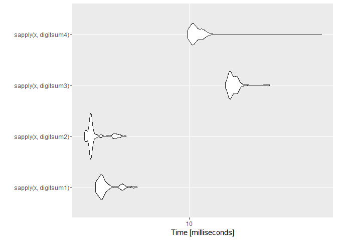

Benchmarking Functions to Compute the Sum of Digits
===================================================

#### *Uwe Block*

#### 2016-03-28

Introduction
------------

This is inspired by [Rätsel der Woche](http://www.spiegel.de/wissenschaft/mensch/raetsel-der-woche-verflixtes-jahr-2016-a-1069870.html) (*Puzzle of the Week*) in [Spiegel Online](http://www.spiegel.de/wissenschaft/mensch/raetsel-der-woche-verflixtes-jahr-2016-a-1069870.html) titled [Verflixtes Jahr 2016](http://www.spiegel.de/wissenschaft/mensch/raetsel-der-woche-verflixtes-jahr-2016-a-1069870.html) (*Cursed Year 2016*) by [Holger Dambeck](http://www.spiegel.de/impressum/autor-1707.html). The puzzle requires to find all years where the sum of the year plus the sum of digits of the year plus the sum of digits of the sum of digits of the year yields 2016.

Here is *one* of the possible solutions (there are some more to find):

``` r
1992 + sum_of_digits(1992) + sum_of_digits(sum_of_digits(1992)) =
1992 + (1 + 9 + 9 + 2)     + sum_of_digits(sum_of_digits(1992)) =
1992 + 21                  + sum_of_digits(sum_of_digits(1992)) =
1992 + 21                  + sum_of_digits(21)                  =
1992 + 21                  + (2 + 1)                            =
1992 + 21                  + 3                                  =
2016
```

To find all solutions requires to test a vector of calendar years. However, I was quite surprised to learn that `R` lacks a built-in function for computing the sum of digits of an integer number. Searching the web I found two hints

-   <http://stackoverflow.com/questions/18675285/digit-sum-function-in-r>
-   <https://stat.ethz.ch/pipermail/r-help/2011-March/270786.html>

suggesting different ways to compute the sum of digits. Unfortunately, the different methods were not compared in terms of speed.

Function Definitions
--------------------

### Variant 1

Suggested by [user2030503](http://stackoverflow.com/users/2030503/user2030503) in his question on [stackoverflow](http://stackoverflow.com/q/18675285/3817004) and by Ivan Calandra in the [R-help mailing list](https://stat.ethz.ch/pipermail/r-help/2011-March/270713.html):

``` r
digitsum1 <- function(x) sum(as.numeric(unlist(strsplit(as.character(x), split = ""))))
```

Sample results:

``` r
digitsum1(1234L)
#> [1] 10
sapply(1992L:2012L,  digitsum1)
#>  [1] 21 22 23 24 25 26 27 28  2  3  4  5  6  7  8  9 10 11  3  4  5
```

### Variant 2

Suggested by [Julius](http://stackoverflow.com/users/1320535/julius) in his answer on [stackoverflow](http://stackoverflow.com/a/18675519/3817004):

``` r
digitsum2 <- function(x) sum(floor(x / 10^(0:(nchar(x) - 1))) %% 10)
```

Sample results:

``` r
digitsum2(1234L)
#> [1] 10
sapply(1992L:2012L,  digitsum2)
#>  [1] 21 22 23 24 25 26 27 28  2  3  4  5  6  7  8  9 10 11  3  4  5
```

### Variant 3

Using function `digitsBase` from package `GLDEX` as suggested by [42-](http://stackoverflow.com/users/1855677/42) in his answer on [stackoverflow](http://stackoverflow.com/a/18675445/3817004):

``` r
library(GLDEX, quietly = TRUE)
digitsum3 <-  function(x) sum(digitsBase(x, base = 10))
```

Sample results:

``` r
digitsum3(1234L)
#> [1] 10
sapply(1992L:2012L,  digitsum3)
#>  [1] 21 22 23 24 25 26 27 28  2  3  4  5  6  7  8  9 10 11  3  4  5
```

### Variant 4

Based on a function by Greg Snow in the [R-help mailing list](https://stat.ethz.ch/pipermail/r-help/2011-March/270786.html):

``` r
digitsum4 <- function(x) sum(x %/% 10^seq(0, length.out = nchar(x)) %% 10)
```

Sample results:

``` r
digitsum4(1234L)
#> [1] 10
sapply(1992L:2012L,  digitsum4)
#>  [1] 21 22 23 24 25 26 27 28  2  3  4  5  6  7  8  9 10 11  3  4  5
```

Benchmarks
----------

``` r
library(microbenchmark, quietly = TRUE)
library(ggplot2, quietly = TRUE)

# define check function
my_check <- function(values) {
  all(sapply(values[-1], function(x) identical(values[[1]], x)))
}

x <- 1234L
bm1 <- microbenchmark(
  digitsum1(x),
  digitsum2(x),
  digitsum3(x),
  digitsum4(x),
  times = 1000L, check = my_check
)
print(bm1, digits = 3)
#> Unit: microseconds
#>          expr   min    lq  mean median    uq    max neval
#>  digitsum1(x)  2.64  3.40  4.01   3.78  4.15   48.3  1000
#>  digitsum2(x)  2.27  2.64  3.45   3.02  3.40   18.9  1000
#>  digitsum3(x) 13.59 15.48 19.63  16.99 19.26 1283.4  1000
#>  digitsum4(x)  8.69 10.20 12.66  10.95 12.08  751.0  1000
autoplot(bm1)
```

<!-- -->

``` r

x <- 1001L:2000L
bm2 <- microbenchmark(
  sapply(x, digitsum1),
  sapply(x, digitsum2),
  sapply(x, digitsum3),
  sapply(x, digitsum4),
  times = 100L, check = my_check
)
print(bm2, digits = 3)
#> Unit: milliseconds
#>                  expr   min    lq  mean median    uq   max neval
#>  sapply(x, digitsum1)  3.41  3.59  3.86   3.68  3.89  5.49   100
#>  sapply(x, digitsum2)  3.00  3.19  3.41   3.25  3.34  4.83   100
#>  sapply(x, digitsum3) 15.07 15.85 16.59  16.22 17.09 24.89   100
#>  sapply(x, digitsum4)  9.76 10.29 11.18  10.56 11.48 45.20   100
autoplot(bm2)
```

<!-- -->

Conclusion
----------

Variant 2 is slightly faster than variant 1 while variants 4 and 3 are much slower. Although the code of variant 4 seems to be similar to variant 2, variant 4 is less efficient (but still better than variant 3).

Please, note that *no* checks on the validity of input parameters is included in the function definitions.

Session Info
------------

``` r
devtools::session_info()
#> Session info --------------------------------------------------------------
#>  setting  value                                      
#>  version  R version 3.2.4 Revised (2016-03-16 r70336)
#>  system   x86_64, mingw32                            
#>  ui       RTerm                                      
#>  language (EN)                                       
#>  collate  German_Germany.1252                        
#>  tz       Europe/Berlin                              
#>  date     2016-03-29
#> Packages ------------------------------------------------------------------
#>  package        * version date       source        
#>  cluster        * 2.0.3   2015-07-21 CRAN (R 3.2.4)
#>  colorspace       1.2-6   2015-03-11 CRAN (R 3.2.4)
#>  devtools         1.10.0  2016-01-23 CRAN (R 3.2.4)
#>  digest           0.6.9   2016-01-08 CRAN (R 3.2.4)
#>  evaluate         0.8.3   2016-03-05 CRAN (R 3.2.4)
#>  formatR          1.3     2016-03-05 CRAN (R 3.2.4)
#>  ggplot2        * 2.1.0   2016-03-01 CRAN (R 3.2.4)
#>  GLDEX          * 2.0.0.3 2015-07-04 CRAN (R 3.2.4)
#>  gtable           0.2.0   2016-02-26 CRAN (R 3.2.4)
#>  htmltools        0.3.5   2016-03-21 CRAN (R 3.2.4)
#>  knitr            1.12.3  2016-01-22 CRAN (R 3.2.4)
#>  magrittr         1.5     2014-11-22 CRAN (R 3.2.4)
#>  memoise          1.0.0   2016-01-29 CRAN (R 3.2.4)
#>  microbenchmark * 1.4-2.1 2015-11-25 CRAN (R 3.2.4)
#>  munsell          0.4.3   2016-02-13 CRAN (R 3.2.4)
#>  plyr             1.8.3   2015-06-12 CRAN (R 3.2.4)
#>  Rcpp             0.12.3  2016-01-10 CRAN (R 3.2.4)
#>  rmarkdown        0.9.5   2016-02-22 CRAN (R 3.2.4)
#>  scales           0.4.0   2016-02-26 CRAN (R 3.2.4)
#>  stringi          1.0-1   2015-10-22 CRAN (R 3.2.3)
#>  stringr          1.0.0   2015-04-30 CRAN (R 3.2.4)
#>  yaml             2.1.13  2014-06-12 CRAN (R 3.2.4)
```
